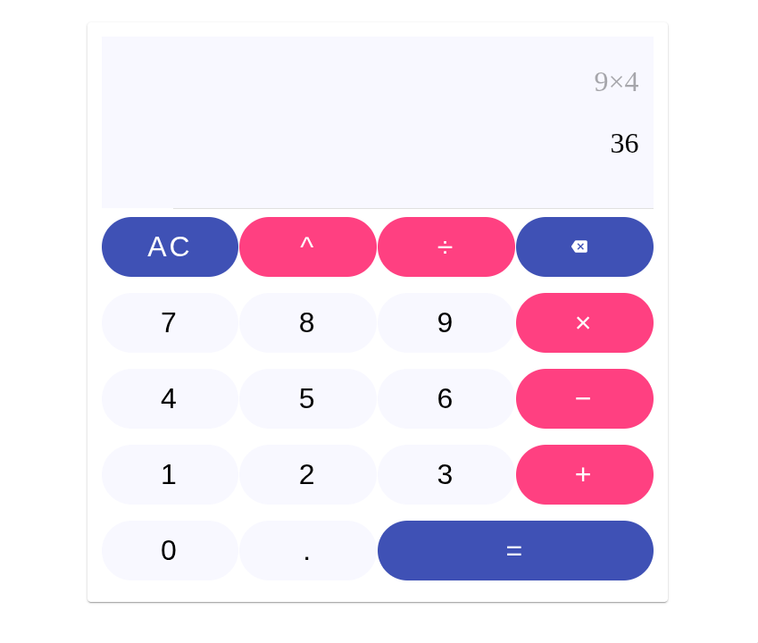

# Calculadora Angular (Angular 18)

Descripción
- Aplicación de calculadora desarrollada con Angular 18. Soporta operaciones básicas (+, −, ×, ÷), potencia (^), decimales, borrado (AC y retroceso) y cálculo del resultado (=).
- Interfaz responsiva inspirada en diseño moderno con botones grandes y fácil interacción tanto con clics como con teclado.

Tecnologías
- Angular 18
- TypeScript
- SCSS
- Herramientas: Node.js, npm

Requisitos
- Node.js y npm instalados en tu sistema.
- (Opcional) Angular CLI instalado globalmente para usar comandos `ng`.

Instalación
1. Clona el repositorio:

   git clone <repo-url>

2. Entra en la carpeta del proyecto:

   cd calculadora-angular-18

3. Instala dependencias:

   npm install

Ejecución en desarrollo
- Ejecuta la aplicación en modo desarrollo (si el script `start` está definido en `package.json`):

   npm start

- O usando Angular CLI directamente:

   ng serve --open

- Abre `http://localhost:4200/` en tu navegador si el navegador no se abre automáticamente.

Construcción para producción
- Genera los artefactos de producción:

   ng build --configuration production

- Los archivos resultantes se colocan en `dist/`.

Uso (resumen de controles)
- Botones principales:
  - AC: limpiar toda la entrada.
  - ← (retroceso): eliminar último carácter.
  - ^ : potencia (por ejemplo: 2 ^ 3 = 8).
  - ÷, ×, −, + : operaciones aritméticas.
  - . : separador decimal.
  - = : calcular el resultado.
- Soporte de teclado: usa las teclas numéricas, `+ - * / . Enter` y `Backspace` según la implementación del componente.

Estructura relevante del proyecto
- `src/app/pages/calculator/` — componente principal de la calculadora (HTML, SCSS, TS, tests).
- `src/app/shared/pipes/` — pipes compartidos (por ejemplo: `operator-symbol.pipe.ts`).
- `src/assets/` — coloca aquí la captura utilizada en este README: `src/assets/calculator.png`.

Incluir la imagen en el README
- Copia la imagen de la calculadora a `src/assets/calculator.png`. El archivo ya referenciado en este README mostrará la captura.

Pruebas
- Ejecuta pruebas unitarias:

   ng test

Contribuciones
- Si quieres mejorar la calculadora, crea una rama (`git checkout -b feature/mi-mejora`), haz tus cambios y abre un pull request.

Licencia
- Añade la licencia que prefieras (por ejemplo, MIT) o modifica esta sección según corresponda.

Notas finales
- Si no ves la imagen, verifica que la ruta `src/assets/calculator.png` exista y que el archivo esté en el repositorio. Ajusta la ruta en el README si la guardas en otra ubicación.
